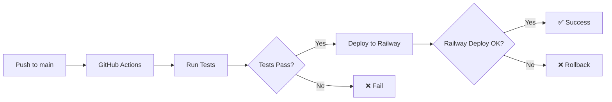

# 🔄 Настройка CI/CD для Controlata

## 🎯 Что мы настроим:

1. **Автоматический деплой** при push в main ветку
2. **Тестирование** перед деплоем
3. **Уведомления** о статусе деплоя
4. **Откат** при ошибках

## ⚙️ Настройка GitHub Actions:

### 1. Получить Railway Token
1. Откройте [Railway Dashboard](https://railway.com/project/0502540a-a782-41b5-8fc8-14c1c26c7541)
2. Перейдите в **Settings** → **Tokens**
3. Нажмите **"New Token"**
4. Название: `GitHub Actions Deploy`
5. Скопируйте токен

### 2. Добавить секреты в GitHub
1. Откройте [GitHub Repository](https://github.com/ZoomerDeveloper/controlata-backend)
2. Перейдите в **Settings** → **Secrets and variables** → **Actions**
3. Нажмите **"New repository secret"**
4. Добавьте:
   - **Name**: `RAILWAY_TOKEN`
   - **Value**: `ваш-railway-token`

### 3. Настроить Railway для автоматического деплоя
1. В Railway Dashboard перейдите в **Settings** → **GitHub**
2. Подключите репозиторий `ZoomerDeveloper/controlata-backend`
3. Включите **"Auto Deploy"** для ветки `main`

## 🧪 Тестирование CI/CD:

### 1. Создать тестовый коммит
```bash
# Внесите любое изменение
echo "# Test CI/CD" >> README.md
git add .
git commit -m "test: trigger CI/CD pipeline"
git push origin main
```

### 2. Проверить статус
1. Откройте [GitHub Actions](https://github.com/ZoomerDeveloper/controlata-backend/actions)
2. Убедитесь, что workflow запустился
3. Проверьте логи выполнения

### 3. Проверить деплой
1. Откройте Railway Dashboard
2. Убедитесь, что новый деплой запустился
3. Проверьте логи деплоя

## 🔧 Дополнительные настройки:

### Уведомления в Slack/Discord (опционально)
Добавьте в `.github/workflows/deploy.yml`:

```yaml
- name: Notify Slack
  if: failure()
  uses: 8398a7/action-slack@v3
  with:
    status: failure
    text: 'Deploy failed for ${{ github.repository }}'
  env:
    SLACK_WEBHOOK_URL: ${{ secrets.SLACK_WEBHOOK_URL }}
```

### Автоматические тесты
Создайте файл `tests/basic.test.js`:

```javascript
const request = require('supertest');
const app = require('../src/server');

describe('Basic API Tests', () => {
  test('Health check endpoint', async () => {
    const response = await request(app)
      .get('/health')
      .expect(200);
    
    expect(response.body.status).toBe('OK');
  });
});
```

### Откат при ошибках
Railway автоматически откатывает деплой, если:
- Приложение не запускается
- Health check не проходит
- Ошибки в логах

## 📊 Мониторинг деплоев:

### GitHub Actions
- **URL**: https://github.com/ZoomerDeveloper/controlata-backend/actions
- **Статус**: ✅ Success / ❌ Failed
- **Логи**: Детальная информация об ошибках

### Railway Dashboard
- **URL**: https://railway.com/project/0502540a-a782-41b5-8fc8-14c1c26c7541
- **Метрики**: CPU, Memory, Network
- **Логи**: Application logs

## 🚀 Workflow процесса:



## 🔍 Troubleshooting:

### Если деплой не запускается:
1. Проверьте, что Railway Token добавлен в GitHub Secrets
2. Убедитесь, что репозиторий подключен в Railway
3. Проверьте права доступа

### Если деплой падает:
1. Проверьте логи в GitHub Actions
2. Проверьте логи в Railway Dashboard
3. Убедитесь, что все переменные окружения настроены

### Если приложение не запускается:
1. Проверьте `package.json` scripts
2. Убедитесь, что `Dockerfile` корректен
3. Проверьте переменные окружения

## ✅ Чек-лист настройки:

- [ ] Railway Token добавлен в GitHub Secrets
- [ ] Репозиторий подключен в Railway
- [ ] Auto Deploy включен
- [ ] Тестовый коммит прошел успешно
- [ ] Приложение доступно по URL
- [ ] Health check работает
- [ ] API endpoints отвечают

## 🎉 Готово!

Теперь при каждом push в main ветку:
1. ✅ Запускаются тесты
2. ✅ Собирается приложение  
3. ✅ Деплоится на Railway
4. ✅ Проверяется работоспособность
5. ✅ Откатывается при ошибках
